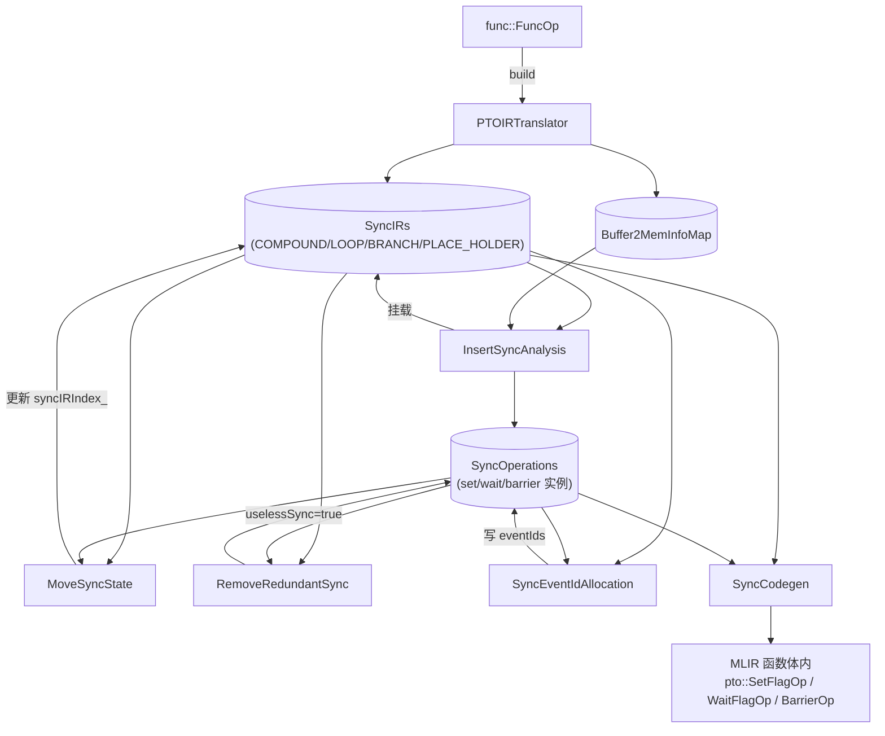
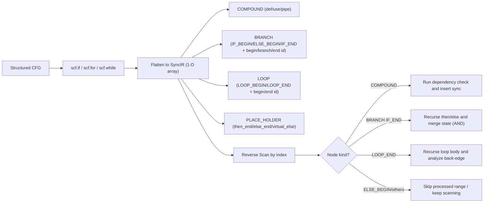
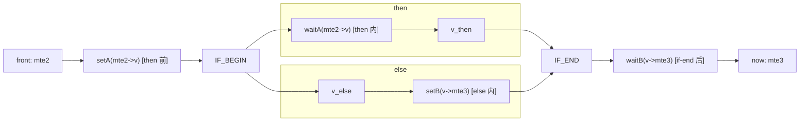
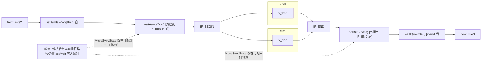
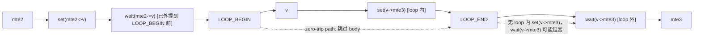
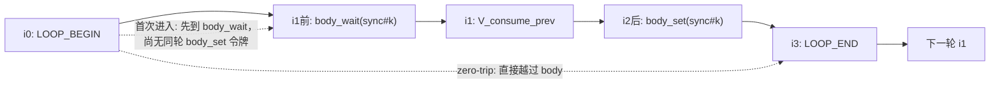
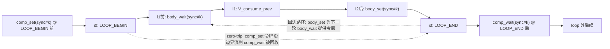

# PTOAS InsertSync 自动同步机制

本文围绕三个核心问题展开：依赖如何判定、同步如何插入、event id 如何分配。

---

## 1. 问题的背景：硬件架构带来的乱序风险和同步的需求

在 PTOAS 中，指令不会按源码顺序串行执行。多条 pipe 并行后，只要 producer 和 consumer 落在同一底层内存，就可能发生时序竞争。InsertSync 的职责就是把这种真实依赖转换成最小必要同步。

先约定文中涉及的常见 pipe 类型：

- `PIPE_MTE2`：入搬运，常见 GM -> L1/UB。
- `PIPE_V`：向量计算。
- `PIPE_M`：矩阵计算。
- `PIPE_MTE3`：出搬运，常见 L1/UB -> GM。
- `PIPE_S`：标量和控制辅助。

最常见的数据通路是 `MTE2 -> V/M -> MTE3`。跨 pipe 共享底层内存时，同步是正确性的必要条件。

---

## 2. 流程并不复杂，但顺序很关键

`PTOInsertSync` pass 的顺序如下：

`PTOIRTranslator -> InsertSyncAnalysis -> MoveSyncState -> RemoveRedundantSync -> SyncEventIdAllocation -> SyncCodegen`

这条流水线可以拆成三段：

1. 先识别依赖，生成同步分析对象。
2. 再把同步位置在控制流边界上标注清楚。
3. 最后分配 event id 并落成真实指令。

---

## 3. 核心数据结构

代码实现位于 `lib/PTO/Transforms/InsertSync/`，对应头文件在
`include/PTO/Transforms/InsertSync/`。下面这一节把贯穿整个 pass 流水线的关键
类型集中列出来，后续章节描述算法时会反复引用这些字段。

### 3.1 顶层容器

| 类型别名 | 定义 | 角色 |
| --- | --- | --- |
| `SyncIRs` | `SmallVector<std::unique_ptr<InstanceElement>>` | 拉直后的指令序列，pass 之间共享 |
| `SyncOperations` | `SmallVector<SmallVector<std::unique_ptr<SyncOperation>>>` | 同步对存储区，外层下标 = `kSyncIndex`，内层 0/1 对应 set/wait（barrier 只占一个槽） |
| `Buffer2MemInfoMap` | `DenseMap<Value, SmallVector<std::unique_ptr<BaseMemInfo>>>` | SSA Value → 一组 `BaseMemInfo`，用于跟踪 view/alias |
| `SyncOps` | `std::deque<SyncOperation*>` | 节点上的 `pipeBefore` / `pipeAfter` 同步队列 |

`PTOInsertSyncPass::runOnOperation`（`PTOInsertSync.cpp:64`）会一次性创建以上四个容器，
然后按顺序传递给后面六个 pass。容器只在最末尾 `SyncCodegen::Run()` 阶段才转换成
真实的 `pto::SetFlagOp / WaitFlagOp / BarrierOp`。

### 3.2 SyncIR 节点：`InstanceElement` 家族

`InstanceElement`（`SyncCommon.h:229`）是抽象基类，所有节点都带：

- `unsigned kIndex`：节点在 `syncIR_` 中的稳定索引，`GetIndex()` 暴露。
- `Operation* elementOp`：源 MLIR Op 指针（COMPOUND 节点指向被注释的 op，
  控制流节点指向其 region 边界 op，例如 `scf::ForOp`、`scf::IfOp`、`scf::YieldOp`）。
- `SyncOps pipeBefore` / `SyncOps pipeAfter`：节点前/后挂载的同步指令队列。
- `KindTy kKindTy`：取值 `COMPOUND`、`LOOP`、`BRANCH`、`PLACE_HOLDER`。

派生类按种类区分，字段含义如下表：

| 派生类 | 关键字段 | 说明 |
| --- | --- | --- |
| `CompoundInstanceElement` | `defVec`、`useVec`（均为 `SmallVector<const BaseMemInfo*>`）、`kPipeValue`（`PipelineType`）、`opName`、`compoundCoreType`（`TCoreType`） | 计算/搬运指令节点；`def/use` 是反向扫描时做依赖判断的输入。`compoundCoreType` 区分 CUBE / VECTOR，用于后续的 barrier 选择 |
| `LoopInstanceElement` | `beginId`、`endId`、`kLoopKind`（`LOOP_BEGIN`/`LOOP_END`） | 一对节点共享同一对 `beginId/endId`，端点对偶出现 |
| `BranchInstanceElement` | `beginId`、`branchId`、`endId`、`kBranchKind`（`IF_BEGIN`/`ELSE_BEGIN`/`IF_END`） | `branchId` = else 区间起点；无 else 时 `branchId == endId` |
| `PlaceHolderInstanceElement` | `parentScopeId`、`isVirtualElse`、`parentIfOp` | 占位锚点：then/else 尾部 yield 位置；`isVirtualElse=true` 时 `SyncCodegen` 会按需创建真正的 else block |

`KindTy`、`KindOfLoop`、`KindOfBranch`（`SyncCommon.h:234/267/290`）三个枚举把
节点种类编码进 IR，反向扫描时用 `dyn_cast` 或 `getKind()` 区分处理。
`MAX_MULTI_BUFFER_NUM = 16`（`SyncCommon.h:35`）是多缓冲槽位数上限，决定了
`SyncRecordList` 的固定长度。

### 3.3 内存语义层：`BaseMemInfo`

`BaseMemInfo`（`SyncCommon.h:86-131`）是依赖判断的最小单元：

| 字段 | 类型 | 作用 |
| --- | --- | --- |
| `baseBuffer` | `Value` | 当前 op 直接看到的 SSA buffer（可能是 view/cast 链顶端） |
| `rootBuffer` | `Value` | 静态可知的最根缓冲区（`alloc_tile` / kernel arg / `memref.alloc`） |
| `scope` | `pto::AddressSpace` | 地址空间（GM/MAT/VEC/ACC/LEFT/RIGHT 等） |
| `baseAddresses` | `SmallVector<uint64_t>` | 已知的偏移列表，配合 `allocateSize` 做精确区间重叠 |
| `allocateSize` | `uint64_t` | 字节大小 |

`operator==`（第 111 行）要求 `baseAddresses`、`rootBuffer`、`scope`、
`allocateSize`、`baseBuffer` 全部相等才算同一缓冲；这是别名分析里的「严格相等」
判定，命中后可直接走依赖路径。

### 3.4 同步指令：`SyncOperation`

`SyncOperation`（`SyncCommon.h:137-219`）描述一个 set/wait/barrier 实例。
关键字段分两组：

身份与位置：

- `type_`：`SET_EVENT` / `WAIT_EVENT` / `PIPE_BARRIER` / `PIPE_BARRIER_CUBE`
  / `PIPE_BARRIER_VECTOR` / `SYNC_BLOCK_SET` / `SYNC_BLOCK_WAIT` / `SYNC_BLOCK_ALL`。
- `srcPipe_`、`dstPipe_`：流水线方向。
- `kSyncIndex_`：在 `syncOperations_` 中的对索引，set/wait 共享同一个值。
- `syncIRIndex_`：挂载的 SyncIR 节点 index；通过 `SetSyncIRIndex` 在
  `MoveSyncState` 期间被更新。
- `forEndIndex_`：可选的循环 endId 标记，存在即说明该同步与回边相关。

分配与剪枝相关：

- `eventIds`（`SmallVector<int>`）+ `eventIdNum`：分配后填入的 event id 列表，
  长度 = `eventIdNum`（多缓冲场景大于 1）。
- `depRootBuffers`：构造该同步对的依赖链所涉及的 root buffer 集合，
  用于分配/widening 阶段的启发式和调试信息；`RemoveRedundantSync` 删除
  set/wait 冗余时按 pipe pair 语义判断，不把 root buffer 相等作为必要条件。
- `uselessSync`：`RemoveRedundantSync` 命中后置为 true，最终从 `pipeBefore/After` 中移除。
- `isCompensation`：预留给分析阶段提前生成的 synthetic compensation sync。
  当前 loop 回边的 head/tail 配对同步由 `SyncEventIdAllocation` 在冗余删除之后生成。
- `lowestCommonAncestorBuffer`、`reuseCntForWiden`、`reallocatedLoopHeadTailSync`：
  分配阶段的辅助状态（widen/reallocate 用）。

### 3.5 反向扫描的局部状态：`SyncRecord`

`SyncRecord`（`InsertSyncAnalysis.h:25`）是反向扫描中针对「当前 `now`」维护的工作集：

- `alreadySync`：`std::array<bool, PIPE_LAST + 1>`。某 pipe 的依赖一旦被 set/wait 对覆盖，
  其位置 1，后续同源 pipe 的 hazard 不再重复同步。注意它是 **pipe 级状态**，
  不区分具体 `syncIndex`；一旦 `alreadySync[PIPE_MTE2] = true`，后续所有来自
  `PIPE_MTE2` 的依赖都会被认为已经覆盖。
- `syncFinder`：`DenseMap<int, bool>`，按 `kSyncIndex` 索引，只记录“反扫过程中已经见过
  某个 `syncIndex` 的 wait 端”。它不记录 set 端，也不等价于“某个 pipe 已同步”。
  反扫继续向前遇到同一个 `syncIndex` 的 set 时，才可能把该 set 的源 pipe 提升到
  `alreadySync`。这个状态机见 6.1 节「线性例子 B」和 6.4 节的 zero-trip 例子。

`syncFinder` 的更新方向容易读反：`UpdateSyncRecord` 先用
`recordFinder[syncIndex]` 判断当前 set 是否能闭合已经见过的 wait；只有当前 sync 是
`WAIT_EVENT` / `SYNC_BLOCK_WAIT` 时，才会执行 `recordFinder[syncIndex] = true`。
因此 `syncFinder-only` 策略携带的是“wait 端线索”，不是携带已经完成的同步事实。

`SyncRecordList = std::array<SyncRecord, MAX_MULTI_BUFFER_NUM>`：每个多缓冲槽位独立维护，
互不串扰。

### 3.6 Event ID 分配池：`EventCyclePool` / `SyncCycle`

`SyncEventIdAllocation.h:25-37` 给出分配阶段的常量与池结构：

```cpp
constexpr uint kTotalEventIdNum            = 8;   // 普通同步可用 id 上限
constexpr uint kBlockSyncSetWaitEventIdNum = 16;  // BlockSync 池大小
constexpr uint kBlockSyncAllCubeEventId    = 14;  // 预留给 BlockAllCube 的 id
constexpr uint kBlockSyncAllVectorEventId  = 15;
constexpr uint kMaxWidenTryNum             = 99;  // widen 复用上限

struct EventCyclePool {                 // 单个 (srcPipe,dstPipe) 池
  SmallVector<SmallVector<unsigned>> slot;  // slot[id] = [s0, e0, s1, e1, ...]
};
using SyncCycle = DenseMap<int, EventCyclePool>;  // key = ScopePair(s)
```

`ScopePair(s)` 把 `(srcPipe, dstPipe)` 编码成 `((dstT << 8) | srcT) + 1`，
让不同方向的同步对竞争独立的 id 池；BlockSync 用 0 占位，与普通同步隔离。
每个 id 在 `slot[i]` 中存储成对的生命周期端点序列，新申请时检查冲突，
`WidenEventId`、`ReallocatedEventId` 在 id 紧张时尝试复用与重分配。

### 3.7 Codegen 中介结构：`SyncPipeBuild`

`SyncCodegen.h:26` 定义的小结构：

```cpp
struct SyncPipeBuild { SyncOps pipeBefore; SyncOps pipeAfter; };
```

`SyncCodegen::UpdateOpInsertSync` 把 `SyncIR` 节点上的 `pipeBefore/pipeAfter`
聚合到 `DenseMap<const Operation*, SyncPipeBuild>`，再在 walk 阶段定位到具体
MLIR op，最终生成 `pto::SetFlagOp` / `pto::WaitFlagOp` / `pto::BarrierOp`。

---

## 4. Pass 内部数据流与关键函数

`PTOInsertSyncPass::runOnOperation`（`PTOInsertSync.cpp:64-145`）按下面的顺序
跑六个子 pass，每一步都消费上游容器、写回同一组容器。这一节给每个阶段写出
「输入 → 主要逻辑 → 输出」三段式简表，并标注关键入口函数与位置。

### 4.0 Pass 触发与短路

进 pass 后第一件事不是分析，而是 walk 一遍函数体（`PTOInsertSync.cpp:73-84`），
若已经存在 `pto::SetFlagOp / WaitFlagOp / RecordEventOp / WaitEventOp`，
直接返回——避免在已经手工同步的 IR 上再叠加自动同步。
另外 `PTOInsertSync.cpp:127-131` 会单独检查函数中是否含有
`pto::TGather/TGatherB/TScatter/MGather/MScatter` 类 op，含则跳过
`RemoveRedundantSync`（A5 上 gather/scatter 与 pipe-pair 化简会冲突）。

### 4.1 `PTOIRTranslator::Build`（`PTOIRTranslator.cpp`）

- 输入：`func::FuncOp`，空的 `SyncIRs`、`Buffer2MemInfoMap`。
- 主要逻辑：
  1. `UpdateKernelArgMemInfo()`：把 kernel 参数登记为 GM root buffer。
  2. `RecursionIR(&func.getBody())`：前序遍历 region：
     - `pto::AllocTileOp` / `DeclareTileMemRefOp` / `PointerCastOp` /
       `memref::AllocOp` 经 `Update*MemInfo` 写入 `buffer2MemInfoMap_`。
     - View / Subview / Cast / Mov 调 `UpdateAliasBufferInfo(result, source)`，
       把派生 buffer 的 `BaseMemInfo` 链回到原 root。
     - `scf::ForOp` / `WhileOp` / `IfOp` / `YieldOp` 经 `UpdateForOpInfo` /
       `UpdateWhileOpInfo` / `UpdateIfOpInfo` / `UpdateYieldOpInfo` 翻译为
       `LoopInstanceElement` / `BranchInstanceElement` / `PlaceHolderInstanceElement`，
       并保证 `beginId/branchId/endId` 在配对节点上一致。
     - 实现了 `OpPipeInterface` 的计算/搬运 op 走 `UpdatePTOOpInfo`：
       通过 `getOpPipeline(op)` 取流水线类型，借 `MemoryEffectOpInterface`
       区分 read/write，再用 `UpdateDefUseVec` 填 `defVec/useVec`，最终构造
       `CompoundInstanceElement` 并 `emplace_back` 到 `syncIR_`。
- 输出：`SyncIRs`（结构化 CFG 已被拉直但保留语义边界）、`Buffer2MemInfoMap`。
- 关键守恒：`PipelineType::PIPE_UNASSIGNED` 的 op 不参与同步分析，直接跳过。

### 4.2 `InsertSyncAnalysis::Run`（`InsertSyncAnalysis.cpp`）

- 输入：`SyncIRs`（来自 4.1）、`MemoryDependentAnalyzer`、空的 `SyncOperations`。
- 主要逻辑（`InsertSyncAnalysis.cpp:43-63`）：
  1. 顶层遍历 `syncIR_`：
     - `CompoundInstanceElement` → `DealWithCompoundSync`（核心同步插入）。
     - `LoopInstanceElement(LOOP_END)` → `DealWithLoopSync`（回边补偿建模）。
     - `BranchInstanceElement` / `PlaceHolderInstanceElement` 顶层跳过，由递归处理。
  2. `DealWithCompoundSync` 调 `InsertSeqSync(now, syncIR_, 0, now->GetIndex(), …)`：
     从 `now-1` 反扫，按节点种类分发：
     - `CompoundInstanceElement` → `InsertSync` → `MemAnalyze`：
       先 `IsNoNeedToInsertSync` 快速剪枝（同 PIPE_S、相同 op 且非回边），
       再用 `MemoryDependentAnalyzer::DepBetween` 判 RAW/WAR/WAW，命中调
       `InsertSyncOperation` 写 set/wait 或 barrier，并通过 `UpdateAlreadySync`
       维护 `SyncRecordList`。
     - `LoopInstanceElement` → `InsertLoopSync`：递归扫描循环体切片。因为 loop 运行时
       可能零次执行，递归扫描得到的 body `alreadySync` 不能提升到外层扫描状态；
       当前实现只把 body 内学到的 `syncFinder` 复制回外层。这样既避免 #533 里
       zero-trip 路径误删 loop 外同步，又保留 #564 这类嵌套 K-loop 中的 set/wait
       匹配线索。
     - `BranchInstanceElement` → `InsertBranchSync`：递归扫描 then/else，
       通过 `MergeAlreadySync` 做交集合并（仅两分支都同步才置位）。
  3. `DealWithLoopSync` 拷贝 `[beginId, endId)` 切片到本地 `backSyncIr`，
     再借 `InsertBackForSync` 让循环体内的 compound 与「上一迭代」的 producer 配对，
     这就是 6.4 节「跨迭代依赖」的实现入口。
  4. 全部扫描完毕，若 `insertBarAllAtLast=true`，调 `InsertLastPipeAll` 在最后一条
     compound 后追加全局 barrier。
- 输出：`SyncIRs` 中 `pipeBefore/pipeAfter` 已被填上 `SyncOperation*`；
  `SyncOperations` 已存对应 `unique_ptr` 实例。
- 关键不变量：每个 `kSyncIndex` 对应内层最多 2 个槽（set+wait）或 1 个槽（barrier）。

### 4.3 `MoveSyncState::Run`（`MoveSyncState.cpp`）

- 输入：4.2 的产物。
- 主要逻辑：
  - `MoveOutBranchSync`：遍历 `IF_BEGIN` 节点，对 then/else 子区间调
    `PlanMoveOutBranchSync`，再分流到 `PlanMoveOutIfWaitSync`（外提 wait）和
    `PlanMoveOutIfSetSync`（外推 set）。命中条件是配对 set/wait 至少有一端
    完全在分支外。
  - `MoveForSync`：循环版本，`MoveOutSync` → `PlanMoveOutWaitSync` /
    `PlanMoveOutSetSync` 把可上提到 `LOOP_BEGIN` 前 / 下沉到 `LOOP_END` 后的
    同步对外提，让边界形态可读、并为后续补偿留出锚点。
- 输出：原地更新 `pipeBefore/pipeAfter` 与 `SyncOperation::syncIRIndex_`。
- 注意：MoveSyncState 不会改变 `kSyncIndex`，set/wait 仍然通过 `syncOperations_[k]`
  配对；它只是「换了挂载位置」。

### 4.4 `RemoveRedundantSync::Run`（`RemoveRedundantSync.cpp`）

- 触发条件：见 4.0 节，函数若含 gather/scatter 类 op 则整体跳过。
- 输入：4.3 的产物。
- 主要逻辑：
  1. 收集所有 `syncOperations_[k].size()==2` 的 set/wait 对，按 `forEndIndex` /
     `kSyncIndex` 排序（内层优先）。
  2. 对每对 `(setFlag, waitFlag)`：跳过 `isCompensation` 标记的预生成补偿同步，
     再走 `CheckAllSync`。
  3. `CheckAllSync` → `CheckRepeatSync` 在 `[setIRIndex, waitIRIndex]` 区间扫描
     `pipeBefore/pipeAfter`，遇到分支调 `CheckBranchBetween`、遇到循环调
     `CheckLoopBetween`。`CanMatchedSync` 用一个 `SmallVector<bool>` 充当
     `syncFinder` 状态机：先看见相同 `kSyncIndex` 之外的 set，置位；再看见对应
     wait 时确认配对；只要内部完整同步对的 pipe pair 相同且 `eventIdNum`
     不大于外部同步对，就认为外层同步对被覆盖。
  4. 命中后置 `uselessSync=true`，并通过 `InstanceElement::RemoveSync` 从挂载队列摘除。
- 输出：被标记为冗余的 `SyncOperation` 仍保留在 `syncOperations_` 中
  （便于打印/调试），但不再出现在任何 `SyncIR` 节点的 `pipeBefore/After`。
- 保守边界：`CheckLoopBetween` 直接返回 false，因为循环可能零次执行；
  `CheckBranchBetween` 要求 then 与 else 同时覆盖才视为冗余。

### 4.5 `SyncEventIdAllocation::Allocate`（`SyncEventIdAllocation.cpp`）

- 输入：4.4 的产物。
- 主要逻辑（按 `Allocate(runNum=0)` 流程）：
  1. **首轮分配**：遍历 `syncIR_`，对每个节点 `pipeBefore` 中尚未分配 id 的 set/wait
     调 `AllocateEventId → SetEventId`：
     - `ScopePair(sync)` 选 id 池；
     - `GetEventPool` + `FindUseEventID` + `CheckSyncLifeCycleConflict` 收集冲突；
     - 优先选空闲 id（`GetEventIdIdleStatus`），其次复用可用 id
       （`GetAvailableEventId` / `UpdateBlockAvailableEventId`）；
     - 选定后调 `SetEventPool`、`SetUseEventID` 写回生命周期；
       若是回边，`UpdateBackwardMatchSync` 把 head/tail 的补偿对挂同一个 id。
  2. **Widen**：再次遍历，调 `WidenEventId` / `TryWidenByOtherSync` 尝试在
     `kMaxWidenTryNum` 次数内合并相邻区间，缩短跨度、抬高复用率。
  3. **回边清理**：`IgnoreBackHeadAndTailSync` 把仅作为占位的回边补偿同步从分配视角移除，
     防止它们再去争用 id。
  4. **Reallocate**：若 `reallocatedPipePair` 非空，调 `ReallocatedEventId` 降级
     `eventIdNum=1` 重试，必要时递归调 `Allocate(runNum+1)`。
  5. **降级 PIPE_ALL**：`ChangeNoEventIdSyncToPipeAll` 把仍未分到 id 的同步转换为
     全局 barrier，保证可生成代码（牺牲性能换正确性）。
- 关键常量：`kTotalEventIdNum=8`、`kBlockSyncSetWaitEventIdNum=16`、
  `kBlockSyncAllCubeEventId=14`、`kBlockSyncAllVectorEventId=15`。
- 输出：每个未被标记为 useless 的 `SyncOperation::eventIds` 已写入合法 id。

### 4.6 `SyncCodegen::Run`（`SyncCodegen.cpp`）

- 输入：4.5 的产物，整个 `func`。
- 主要逻辑：
  1. `UpdateOpInsertSync(rewriter)`：遍历 `syncIR_`，把每个节点的
     `pipeBefore/pipeAfter` 投射到 `op2InsertSync : Operation* → SyncPipeBuild`：
     - `CompoundInstanceElement` 直接复制；
     - `LoopInstanceElement(LOOP_END)`：把 `LOOP_BEGIN` 的 `pipeBefore` 注册到
       `scf::ForOp` 之前、把自身 `pipeAfter` 注册到 `scf::ForOp` 之后；
     - `BranchInstanceElement(IF_END)`：相应地处理 `scf::IfOp` 前后；
     - `PlaceHolderInstanceElement`：若 `isVirtualElse=true` 且 `scf::IfOp`
       缺少 else region，会主动建一个空 else block（含 `scf::YieldOp`）作为锚点。
  2. `func.walk` 找到每个有挂载的 op：先以 `beforeInsert=true` 处理 `pipeBefore`，
     再以 `beforeInsert=false` 反向处理 `pipeAfter`，每个 sync 走 `SyncInsert`：
     - `PIPE_BARRIER*` → `CreateBarrierOp`，A5 上 `PIPE_V` barrier 不生成、
       `PIPE_ALL` 推迟到尾部，相邻同类 barrier 通过 `hasNeighborBarrier` 去重；
     - `eventIds.size()==1` → `CreateSetWaitOpForSingleBuffer`：
       直接构造 `pto::SetFlagOp` / `pto::WaitFlagOp`（`isSyncWaitType()` 区分）；
     - `eventIds.size()>1` → `CreateSetWaitOpForMultiBuffer`：通过 `GetBufferSelected`
       生成运行期选择器（`createNestedIndexModular` 缓存在 `loop2BufferCounter`）。
  3. `AppendAutoSyncTailBarrierIfNeeded`：若分析阶段要求尾部 PIPE_ALL barrier，
     在所有 `func::ReturnOp` 前补一条。
- 输出：MLIR 函数体内已有完整的 `pto::SetFlagOp` / `WaitFlagOp` / `BarrierOp`，
  pass 结束。

### 4.7 整体数据流示意



---

## 5. 依赖识别：def/use + alias 是同一件事的两面

`def/use` 分析不是直接比较 SSA 名字，而是落在 `BaseMemInfo` 上计算。  
其中最关键的字段是 `rootBuffer`、`scope`、`baseAddresses`、`allocateSize`。

hazard 判定按三类关系展开：

- RAW：`now.use` 对 `front.def`
- WAR：`now.def` 对 `front.use`
- WAW：`now.def` 对 `front.def`

命中后处理规则很直接：同 pipe 插 `barrier`，跨 pipe 插 `set/wait`。

### 5.1 alias 到底怎么判

当前实现不是“强证明式 AA”，而是 correctness-first 的 may-alias 规则：

1. `scope` 不同，直接不别名。
2. `GM` 先比较 root，必要时追踪 `realRoot`。
3. 地址和大小都已知，就做区间重叠。
4. 信息缺失（地址未知、size 未知），保守按“可能重叠”。

这套规则在信息不足时会偏保守，但不会牺牲正确性。后续会继续补强动态 shape/offset 场景下的精细分析。

### 5.2 例子：`[V][V][MTE3]`

两个 `V` 在语义上可能写的是同一个 root 下的两个不重叠 subview。  
如果静态阶段能拿到精确 offset/size，系统会判不重叠。  
如果拿不到，会按“可能重叠”处理，此时 `MTE3` 会同时依赖这两个 `V`。

这不是算法错误，而是保守策略带来的结果。

---

## 6. 同步插入：线性、分支、循环

### 6.1 线性序列

在线性序列下，算法是一个双层遍历：

1. 外层：按顺序选当前指令 `now`。
2. 内层：从 `now-1` 向前反扫 `front`。

每次反扫都会维护按 pipe 索引的状态 `alreadySync`。  
它不是全局状态，而是“针对当前 `now`，该源 pipe 的依赖是否已经被某个同步对覆盖”。

一旦 `front` 与 `now` 命中 hazard：

- 同 pipe：在 `now.pipeBefore` 挂 `barrier`。
- 跨 pipe：在 `front.pipeAfter` 挂 `set(src=frontPipe,dst=nowPipe)`，在 `now.pipeBefore` 挂对应 `wait`。

插入后更新 `alreadySync[frontPipe]=true`，用于抑制同类重复同步。

#### 线性例子 A：`[MTE2][V][MTE3]`

这个例子分两轮看最直观。

第一轮，当 `now = V`：

- 反扫到 `front = MTE2`，命中依赖；
- 插入 `set(MTE2->V)`（挂在 `MTE2.pipeAfter`）和 `wait(MTE2->V)`（挂在 `V.pipeBefore`）。

第二轮，当 `now = MTE3`：

- 先扫到 `front = V`，命中依赖，插入 `set(V->MTE3)` + `wait(V->MTE3)`；
- 再往前扫到 `front = MTE2` 时，算法会利用已经存在的同步链路做传递剪枝，不再重复插 `MTE2->MTE3`。

这里的“隐形同步关系”可以理解为：`MTE2 -> V` 与 `V -> MTE3` 叠加后，已经隐含了 `MTE2 -> MTE3` 的顺序约束。

#### 线性例子 B：为什么 `syncIndex` 能识别这条链

上面这个 `[MTE2][V][MTE3]` 场景里，关键不是“看到了某个 set”，而是“识别到匹配的 set/wait 对”。

设 `sync#3` 对应 `MTE2->V` 这组同步：

- `set#3` 在 `MTE2.pipeAfter`
- `wait#3` 在 `V.pipeBefore`

当 `now = MTE3` 反扫时，状态变化是：

1. 先经过 `V.pipeBefore`，看到 `wait#3`，记录 `syncFinder[3]=true`；
2. 再经过 `MTE2.pipeAfter`，看到 `set#3`，且发现 `syncFinder[3]` 已经为真；
3. 因为这一对 `set/wait` 被确认为同一 `syncIndex` 的闭合链条，算法就可以把 `alreadySync[MTE2]` 置为真。

于是后续判定 `front=MTE2` 时，`isAlreadySync` 命中，`MTE2->MTE3` 不再重复插入。

这就是 `syncIndex` 的价值：把“同步链条是否真正闭合”编码成可判定状态，避免只按 pipe 粗粒度去重。

### 6.2 先做一件事：把控制流“拉直”

在同步分析前，`PTOIRTranslator` 会先把结构化控制流（`scf.if/scf.for/scf.while`）转换成一维 `SyncIR` 数组。  
这样做不是为了简化语义，而是为了统一扫描实现：核心算法是“对每个 `now` 做反向扫描”。

但“拉直”不等于丢掉结构。`SyncIR` 里会保留结构节点来恢复语义边界：

- `COMPOUND`：普通指令节点（有 `def/use/pipe`）。
- `LOOP`：`LOOP_BEGIN/LOOP_END`，携带 `beginId/endId`。
- `BRANCH`：`IF_BEGIN/ELSE_BEGIN/IF_END`，携带 `beginId/branchId/endId`。
- `PLACE_HOLDER`：then/else 尾部锚点；无 else 时会有 virtual-else 占位。

每个节点都有稳定 index，因此“线性位置”和“结构边界”可以同时使用。

#### 拉直后的 if/else 示例

```text
[0] COMPOUND  mte2
[1] BRANCH    IF_BEGIN   (begin=1, branch=4, end=7)
[2] COMPOUND  then_v
[3] PLACE_HOLDER (then_end)
[4] BRANCH    ELSE_BEGIN (begin=1, branch=4, end=7)
[5] COMPOUND  else_m
[6] PLACE_HOLDER (else_end / virtual-else)
[7] BRANCH    IF_END     (begin=1, branch=4, end=7)
[8] COMPOUND  mte3
```

#### 拉直后的 loop 示例

```text
[0] COMPOUND  mte2
[1] LOOP      LOOP_BEGIN (begin=1, end=4)
[2] COMPOUND  v
[3] COMPOUND  mte3
[4] LOOP      LOOP_END   (begin=1, end=4)
[5] COMPOUND  tail_v
```

#### CFG 到 SyncIR 的示意图



#### 拉直后如何识别控制流并继续分析

反向扫描并不是一口气按数组扫到底，而是遇到结构节点就切换处理策略：

1. 扫到 `COMPOUND`：按普通依赖规则处理。
2. 扫到 `BRANCH(IF_END)`：调用分支递归分析，分别扫描 then/else 子区间，再按交集合并状态。
3. 扫到 `BRANCH(ELSE_BEGIN)`：在外层扫描中跳过已处理区间，避免重复。
4. 扫到 `LOOP(LOOP_END)`：调用循环递归分析，处理 loop 体内和回边依赖。

换句话说，数组负责承载顺序，`beginId/branchId/endId` 负责恢复语义边界。两者配合后，算法既能线性实现，也不会丢失控制流语义。

### 6.3 if/else

if/else 不是拍平后线性扫完就结束，而是在遇到 `IF_END` 时递归进入 then/else 两段，分别计算同步状态，再合并。

关键规则只有一条：汇合点对 `alreadySync` 做交集（AND），不是并集（OR）。

理由很简单：`now` 在 `if` 之后执行时，只有“两个分支都成立”的同步才是必然成立的同步。

#### 分支例子 A：双分支都命中同类 pipe

假设 `if` 前有 `front(MTE2)`，then/else 内各有一个 `wait(MTE2->V)`，`now` 在 `if-end` 后。  
如果简单做并集，会把“仅 then 成立”误当成“必然成立”，导致漏插。  
做交集后，只有 then 和 else 都能覆盖时，才允许不再新增同步。

#### 分支例子 B：为什么会有 set/wait 跨分支移动

这里采用一种典型形态：

1. `setA` 在 then 分支前（if 外），`waitA` 在 then 分支内。
2. `setB` 在 else 分支内，`waitB` 在 if-end 后（if 外）。

这类结构如果不做边界修正，会出现“同步对分散在不同控制流层级”的问题。  
`MoveSyncState` 的目标是把它规整成“边界可读”的形态：`waitA` 外提到 `IF_BEGIN` 前，`setB` 外提到 `IF_END` 后。

##### 外提之前（示意）



##### 外提之后（示意）



### 6.4 loop 回边

loop 的难点在于“跨迭代依赖”无法通过单次线性扫描直接识别。  
当前实现在 `LOOP_END` 触发回边分析，大体分两步：

1. 复制 loop body 切片做一次局部扫描；
2. 再对原结构做 `now..loopEnd` 后缀扫描，把“后面的 front”解释成“上一迭代 producer”。

只有这样才能命中 loop-carried 依赖。

#### 循环例子 A：`[mte2] loop-begin [v] loop-end [mte3]`

这个例子中，最典型的是两类“set/wait 分居 loop 内外”的场景：

1. `mte2 -> v`：`set` 在 loop 外（`mte2` 后），`wait` 在 loop 内（`v` 前）。
2. `v -> mte3`：`set` 在 loop 内（`v` 后），`wait` 在 loop 外（`mte3` 前）。

边界修正关注的不是“有没有依赖”，而是“每条可执行路径上，配对是否可达”：

- 对 `mte2 -> v` 这组，`wait` 留在 loop 体内会变成“每轮都等一次外部令牌”。  
  `MoveSyncState` 会把这类 `wait` 外提到 `LOOP_BEGIN` 之前，让它只在入环前生效一次。
- 对 `v -> mte3` 这组，若 loop 可能零次执行，`mte3` 前的 `wait` 可能找不到 loop 内 `set`。  
  后续会把这类跨边界同步做 loop 外补偿（在 loop 边界补一对可配对的 `set/wait`），保证零次执行路径也不死锁。

所以这里说的“外提”，本质是把 body 内同步约束折算到 loop 边界，让同步对在控制流上可达且可配。  
但只做外提还不够，`v -> mte3` 这组在 zero-trip 路径仍可能缺少可配对的 `set`，因此还需要补偿同步。

##### 补偿之前（仅完成外提，未加 comp_set/comp_wait）



##### 补偿之后（加入 comp_set/comp_wait）

```mermaid
flowchart LR
  M2A["mte2"]
  S12A["set(mte2->v)"]
  W12A["wait(mte2->v) [外提到 LOOP_BEGIN 前]"]
  CS["comp_set(v->mte3) [LOOP_BEGIN 前]"]
  LBA["LOOP_BEGIN"]
  V2["v"]
  S23A["set(v->mte3) [loop 内]"]
  LEA["LOOP_END"]
  CW["comp_wait(v->mte3) [LOOP_END 后]"]
  W23A["wait(v->mte3) [mte3 前]"]
  M3A["mte3"]

  M2A --> S12A --> W12A --> CS --> LBA --> V2 --> S23A --> LEA --> CW --> W23A --> M3A
  LBA -. "zero-trip path: 仍携带 comp_set 令牌" .-> LEA
  LEA -. "先 comp_wait 回收补偿令牌，再到 wait(v->mte3)" .-> CW
```



#### 循环例子 B：回边同步对的索引形态

看一个最小例子（只关注一组 `V->MTE3` 的回边依赖）：

```text
i0: LOOP_BEGIN(L0)
i1: V_consume_prev        // 本次迭代先消费“上一迭代”的结果
i2: MTE3_produce_next     // 本次迭代末尾生产“下一迭代”要用的数据
i3: LOOP_END(L0)
```

对这组 loop-carried 依赖，分析阶段得到的原始同步对形态是：

- `wait(V<-MTE3)` 挂在 `i1` 前
- `set(MTE3->V)` 挂在 `i2` 后

所以它天然是 `setIndex(2) > waitIndex(1)`。

为什么还要补偿一对 loop 外的 `set/wait`：

1. 首次进入 loop 时会先执行 `wait@i1`，但这时还没有任何一次 `set@i2`，存在“第一拍无令牌”的阻塞风险。
2. 为了让第一拍可启动，需要在 `LOOP_BEGIN` 外先补一个 `set` 作为启动令牌。
3. 这个补进去的启动令牌会让总 `set` 次数比 loop 体内 `wait` 多一次，因此还要在 `LOOP_END` 外补一个 `wait` 把它消费掉，保持配对平衡。

可把补偿后的结构记成：

- `comp_set` 在 `LOOP_BEGIN` 之前
- `body_wait` 在 `i1` 前
- `body_set` 在 `i2` 后
- `comp_wait` 在 `LOOP_END` 之后

##### 补偿生成前（仅原始回边对）



##### 补偿生成后（追加头尾补偿对）



这样既保证 loop 体内回边依赖可启动，也避免补偿令牌泄漏到 loop 外路径。  
即使 loop 零次执行，`comp_set/comp_wait` 也会在 loop 外成对抵消，不会破坏外层时序。

#### 循环例子 C：#533 中 `alreadySync` 与 `syncFinder` 的 zero-trip 差异

`issue533_loop_zero_trip_sync_regression.pto` 的核心形态是：loop 前有一个 `MTE2`
load，loop 后的 `TROWEXPANDDIV` 会消费它；loop body 内部也有若干 `MTE2->V`
同步，但那些同步只覆盖 body 内部的 producer/consumer。

`--pto-insert-sync-debug=3` 的 `After Analysis` 关键片段如下：

```text
[   2] COMPOUND pto.tload [PIPE_MTE2]
  def=[%c10432_i64(VEC)]
  use=[%arg2(GM)]
  POST: set_flag <PIPE_MTE2 -> PIPE_V> idx=11
[   3] LOOP LOOP_BEGIN (begin=3, end=21)
  [   5] COMPOUND pto.tload [PIPE_MTE2]
    POST: set_flag <PIPE_MTE2 -> PIPE_V> idx=0
  [   6] COMPOUND pto.tload [PIPE_MTE2]
    POST: set_flag <PIPE_MTE2 -> PIPE_V> idx=5
  [   7] COMPOUND pto.tmax [PIPE_V]
    PRE : wait_flag <PIPE_MTE2 -> PIPE_V> idx=0
  [  13] COMPOUND pto.tmul [PIPE_V]
    PRE : wait_flag <PIPE_MTE2 -> PIPE_V> idx=5
[  21] LOOP LOOP_END (begin=3, end=21)
[  22] COMPOUND pto.trowexpanddiv [PIPE_V]
  PRE : wait_flag <PIPE_MTE2 -> PIPE_V> idx=11
```

对 `now=[22]` 做反向扫描时，进入 loop body 可以看到 `wait idx=0` 和
`wait idx=5`，`syncFinder-only` 因此可能把 `syncFinder[0]`、`syncFinder[5]`
带回外层；但它不会带出 `alreadySync[PIPE_MTE2]`，也不会制造 `syncFinder[11]`。
所以继续向前扫到 `[2]` 的 `set idx=11` 时，`[2] -> [22]` 这条循环外同步仍然会保留。

如果把 body 的 `alreadySync` 也带出 loop，body 内的 `[6] set idx=5` /
`[13] wait idx=5` 会把 `alreadySync[PIPE_MTE2]` 置真。由于 `alreadySync` 是
pipe 级状态，外层扫描到 `[2] pto.tload [PIPE_MTE2]` 时会直接命中
`isAlreadySync` 并短路，导致 `idx=11` 的 set/wait 整对不生成。zero-trip 时 loop
body 可能根本没执行，这就是 #533 的漏同步根因。

最终正确生成应保留 post-loop 等待：

```cpp
pipe_barrier(PIPE_V);
wait_flag(PIPE_MTE2, PIPE_V, EVENT_ID2);
TROWEXPANDDIV(...);
```

#### 循环例子 D：#564 中 `syncFinder-only` 与 no-carry 的布局差异

`syncFinder` 只携带 wait 端线索，但这条线索仍会影响外层反扫的传递消除。
`issue564_k_loop_mte1_mte2_wait_regression.pto` 的 K-loop 前后可以抽象成：

```text
// K-loop 前 prologue
[   9] COMPOUND pto.tmov [PIPE_MTE1]
  POST: set_flag <PIPE_MTE1 -> PIPE_MTE2> idx=9
[  10] COMPOUND pto.tmov [PIPE_MTE1]
  POST: set_flag <PIPE_MTE1 -> PIPE_MTE2> idx=10
[  11] COMPOUND pto.tmatmul.acc [PIPE_M]
  POST: set_flag <PIPE_M -> PIPE_MTE1> idx=12
[  12] LOOP LOOP_BEGIN (begin=12, end=23)
  [  13] COMPOUND pto.tload [PIPE_MTE2]
    PRE : wait_flag <PIPE_MTE1 -> PIPE_MTE2> idx=9
  [  14] COMPOUND pto.tload [PIPE_MTE2]
    PRE : wait_flag <PIPE_MTE1 -> PIPE_MTE2> idx=10
  [  17] COMPOUND pto.tmov [PIPE_MTE1]
    PRE : wait_flag <PIPE_M -> PIPE_MTE1> idx=12
[  23] LOOP LOOP_END (begin=12, end=23)
```

当外层 loop 的分析反扫穿过这个 inner K-loop 时：

- `syncFinder-only` 会把 inner K-loop body 中看到的 `syncFinder[9]`、
  `syncFinder[10]`、`syncFinder[12]` 带回外层扫描。随后继续扫到 prologue 的
  `[11]/[10]/[9]` set 端时，这些同 `syncIndex` 的 set/wait 可以闭合，进而更新
  `alreadySync`，避免额外补一批 prologue 上的外层 `forEnd` 同步。
- no-carry 完全丢弃 inner K-loop 扫描状态。外层扫到 prologue 时没有这些 wait 端线索，
  于是更保守地生成额外外层回边同步，例如：

```text
[   9] POST: set_flag <PIPE_MTE1 -> PIPE_MTE2> idx=27 forEnd=29 eventIdNum=2
[  10] POST: set_flag <PIPE_MTE1 -> PIPE_MTE2> idx=29 forEnd=29 eventIdNum=2
[  11] POST: set_flag <PIPE_M -> PIPE_MTE1>    idx=31 forEnd=29
```

这里容易混淆的是：“原始同步组”和“no-carry 额外同步组”挂在相同 producer
op 上，但不是同一个 `syncIndex`。在 syncFinder-only 的 `After Analysis` 中，
原始配对是：

```text
[   9] POST: set_flag  <PIPE_MTE1 -> PIPE_MTE2> idx=9
[  13] PRE : wait_flag <PIPE_MTE1 -> PIPE_MTE2> idx=9

[  10] POST: set_flag  <PIPE_MTE1 -> PIPE_MTE2> idx=10
[  14] PRE : wait_flag <PIPE_MTE1 -> PIPE_MTE2> idx=10

[  11] POST: set_flag  <PIPE_M -> PIPE_MTE1> idx=12
[  17] PRE : wait_flag <PIPE_M -> PIPE_MTE1> idx=12
```

也就是说，`[9]/[10]/[11]` 这些 K-loop 前 prologue producer 本来就有自己的
set；对应 wait 在 inner K-loop 入口附近的 consumer 上。`syncFinder-only`
保留的是 `syncFinder[9/10/12] = true` 这种“wait 已经见过”的线索，而不是
新增或移动这些 set。

no-carry 多出来的 `idx=27/29/31` 则是另一批依赖边，wait 端在外层 loop
下一轮开头：

```text
[   9] POST: set_flag  <PIPE_MTE1 -> PIPE_MTE2> idx=27 forEnd=29 eventIdNum=2
[   2] PRE : wait_flag <PIPE_MTE1 -> PIPE_MTE2> idx=27 forEnd=29 eventIdNum=2

[  10] POST: set_flag  <PIPE_MTE1 -> PIPE_MTE2> idx=29 forEnd=29 eventIdNum=2
[   3] PRE : wait_flag <PIPE_MTE1 -> PIPE_MTE2> idx=29 forEnd=29 eventIdNum=2

[  11] POST: set_flag  <PIPE_M -> PIPE_MTE1> idx=31 forEnd=29
[   4] PRE : wait_flag <PIPE_M -> PIPE_MTE1> idx=31 forEnd=29
```

`forEnd=29` 表示这些是外层 loop 的回边同步：当前外层迭代后半段的
`[9]/[10]/[11]`，同步到下一轮外层迭代开头的 `[2]/[3]/[4]`。它们不能直接复用
原来的 `idx=9/10/12`，因为一个 `syncIndex` 表示一条 set/wait 生命周期：
`idx=9/10/12` 已经服务于 prologue 到 inner K-loop 的入环同步；外层回边同步有
不同的 wait 位置和 `forEnd=29` 生命周期，需要独立的同步组和 event 分配。

再看 zero-trip 路径。`idx=9/10/12` 在分析阶段看起来是“loop 外 set、loop 内
wait”，如果 wait 留在 body 内，inner K-loop 零次执行时确实会跳过 wait。后续
`MoveSyncState` 会把这类入环 wait 外提到 inner `LOOP_BEGIN` 的 `pipeBefore`：

```text
[  12] LOOP LOOP_BEGIN (begin=12, end=23)
  PRE : wait_flag <PIPE_MTE1 -> PIPE_MTE2> idx=9
  PRE : wait_flag <PIPE_MTE1 -> PIPE_MTE2> idx=10
  PRE : wait_flag <PIPE_M -> PIPE_MTE1>    idx=12
```

因此最终生成时，这些 wait 位于 inner K-loop 的 `for (...)` 之前。即使 body
零次执行，prologue set 也会被 loop 边界上的 wait 消费。这个性质只说明
`syncFinder[9/10/12]` 可以安全作为 set/wait 匹配线索；它不允许把 body 扫描得到的
`alreadySync` 整体带出 loop，因为后者是 pipe 级事实，无法区分它来自可零次执行的
body 还是来自已外提到 loop 边界的 wait。

实测 `issue564_k_loop_mte1_mte2_wait_regression.pto` 时，三种策略的差异可以概括为：

```text
syncFinder-only:
  After Analysis              syncGroups=31 activeOps=61
  After Remove Redundant Sync syncGroups=31 activeOps=59
  After EventId Allocation    syncGroups=50 activeOps=87
  final C++: FileCheck passed

no-carry:
  After Analysis              syncGroups=34 activeOps=67
  After Remove Redundant Sync syncGroups=34 activeOps=65
  After EventId Allocation    syncGroups=62 activeOps=97
  final C++: FileCheck failed, event sync layout regressed

full-carry:
  final C++ matches syncFinder-only for this case, but it is unsafe for #533
  because body alreadySync may hide required loop-outside sync on zero-trip paths.
```

这说明 `syncFinder-only` 并不是“把 loop body 已经同步过”这个事实带出去；
它只把 wait 端匹配信息带出去。是否能进一步消除同步，还要等外层反扫继续遇到同
`syncIndex` 的 set，并满足 `UpdateSyncRecord` 的传递条件。#533 中 loop 内没有
`idx=11` 的 wait，因此 post-loop `idx=11` 不会被消掉；#564 中 K-loop 内存在
`idx=9/10/12` 的 wait，因此会改变 prologue 侧的外层回边同步布局。

这一点在读 dump 时很关键：不要把“分析产物”和“event 分配产物”混成一层看。

---

## 7. event id 分配：先保正确，再做生命周期分配

### 7.1 首轮生命周期分配算法

分配时先按 `(srcPipe, dstPipe)` 分池，不同方向互不争用。

然后对每组 `set/wait` 做生命周期冲突检查：

1. 先拿当前这组同步的生命周期窗口。
2. 把与已占用窗口冲突的 id 标记掉。
3. 优先选空闲 id，再选可用 id。
4. 选中后把 id 同步写入配对 set/wait，并把生命周期回填到池里。

下面这个例子最直观：

- `A=[10,30] -> id0`
- `B=[35,50]` 与 A 不重叠，可以继续用 `id0`
- `C=[20,40]` 与 A 重叠，`id0` 冲突，只能换别的 id

### 7.2 回边为什么看起来“特殊”

实现上有两个关键细节：

1. 头尾补偿 set/wait 不是分析阶段生成的，而是在 `SyncEventIdAllocation` 里“分到某个 id 后”追加。
2. 追加出来的补偿同步，不会再单独跑一次选 id，而是直接继承这次分到的同一个 id。

### 7.3 回边默认按全函数生命周期判冲突的原因

这个策略看起来偏保守，但与回边语义一致：

1. 回边本质是环形依赖，不是普通线性区间。
2. 默认补偿同步放在函数头尾，生命周期天然被拉长。
3. 因此先用更大窗口保证不串扰。

### 7.4 回边例子（仅保留基础分配规则）

以单个回边同步对为例：

1. 原始同步对先按生命周期拿到一个可用 `id`。
2. 随后在函数头尾追加的补偿同步对，直接继承这个 `id`。
3. codegen 阶段按同一个 `id` 落成对应的 `set/wait`。

---

## 8. 线性序列的形式化证明（简版）

设线性指令序列为 \(I_1,\dots,I_n\)，每条指令有读集 \(R_k\)、写集 \(W_k\)、pipe \(P(k)\)。  
定义 hazard：

\[
H(i,j),\ i<j
\]
当且仅当 RAW/WAR/WAW 任一成立。

算法对每个 \(j\) 做 \(i=j-1..1\) 的反向扫描，首次命中某源 pipe 时插同步并置 `alreadySync[pipe]=true`。

证明思路：

1. 对固定 \(j\) 和任意 hazard 源 pipe \(s\)，取最近 hazard producer \(t_s\)。
2. 扫描首次命中该 pipe 必在 \(t_s\) 处。
3. 若跨 pipe，`set@t_s + wait@j` 建立顺序；若同 pipe，`barrier@j` 建立顺序。
4. 更早的同 pipe producer 由同一约束覆盖。

因此任意 \(H(i,j)\) 都有对应同步约束，线性序列 soundness 成立。

---

## 9. 结论

可以归纳为一句话：

InsertSync 目前是一套“正确性优先”的同步系统：alias 在信息不足时保持保守，回边按环形依赖做特殊建模，event id 按生命周期分配并与补偿同步保持一致。

后续优化的主方向仍然是两条：alias 精度提升、event 资源利用率提升。
